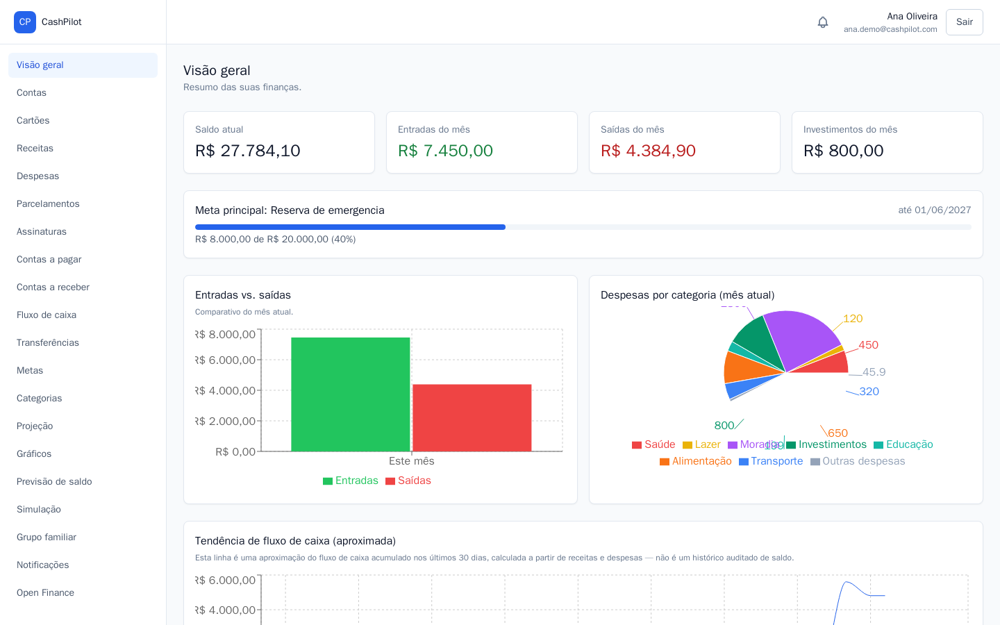
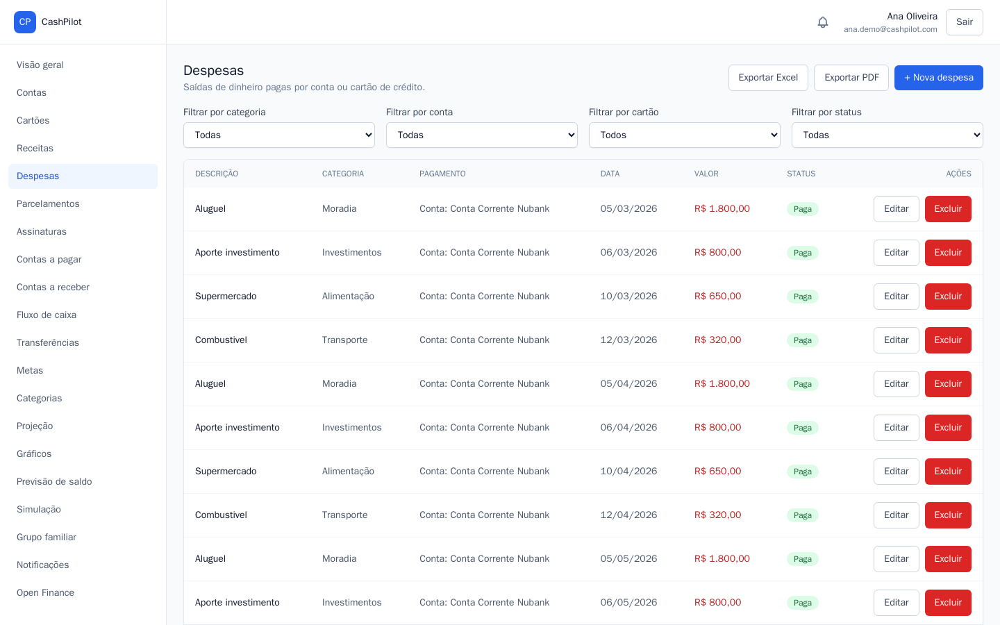
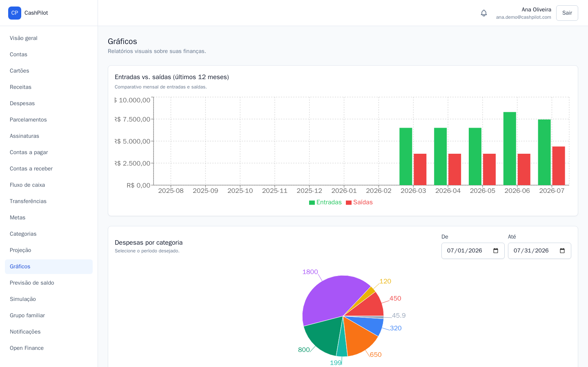
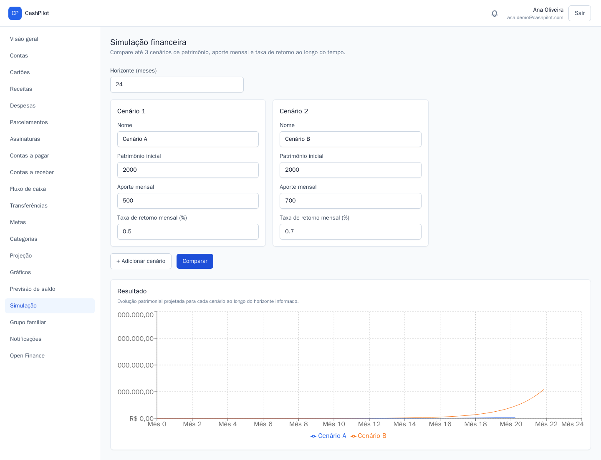
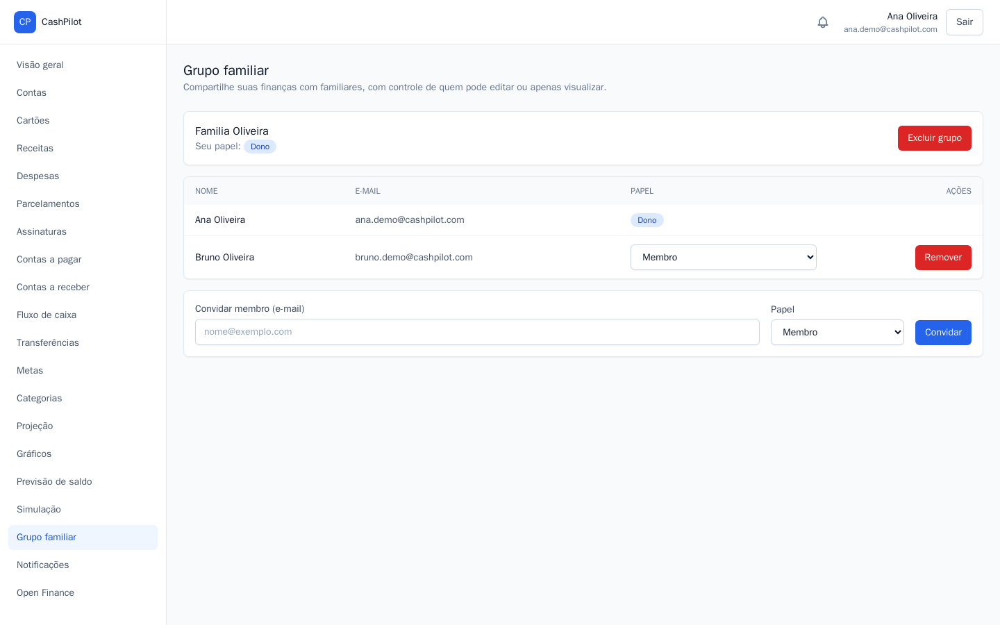
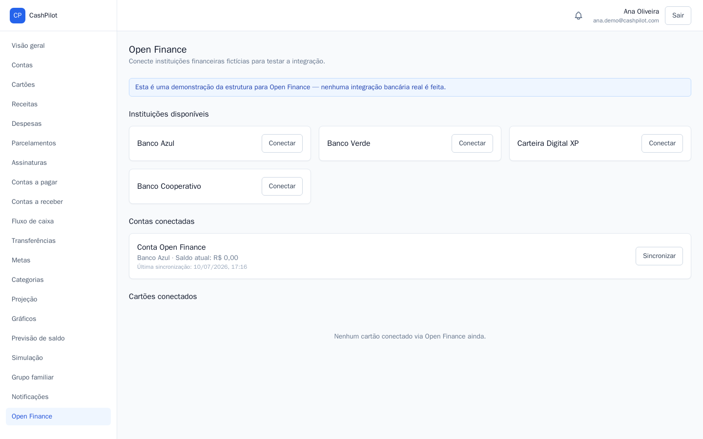

<div align="center">

# CashPilot

### Personal finance management platform that scales into small-business cash flow

[](https://openjdk.org/)
[](https://spring.io/projects/spring-boot)
[](https://react.dev/)
[](https://www.typescriptlang.org/)
[](https://www.postgresql.org/)
[](https://www.docker.com/)
[](#-license)

</div>

---

## 📖 About the project

**CashPilot** is a personal financial management platform: track bank accounts, credit cards, income, expenses, transfers and goals in one place, and get a financial projection of when you'll hit a net-worth target based on your current savings rate.

> Accounts & cards ➜ record **income** and **expenses** against them ➜ track progress on **goals** ➜ get a **projection** of when you'll reach your target net worth.

This repository is a **monorepo** containing both halves of the system:

| Package | Description | Docs |
|---|---|---|
| [`backend/`](backend) | Spring Boot 3 REST API — JWT auth, PostgreSQL + Flyway migrations, MapStruct mappers | [backend/README.md](backend/README.md) |
| [`frontend/`](frontend) | React + TypeScript SPA that consumes the API, charts via Recharts | [frontend/README.md](frontend/README.md) |

---

## 📸 Screenshots

| Dashboard | Expenses |
|---|---|
|  |  |

| Reports | Financial simulation |
|---|---|
|  |  |

| Family group | Open Finance (stub) |
|---|---|
|  |  |

---

## 🚀 Quick start (full stack, with Docker)

```bash
git clone https://github.com/duanjesus/cashpilot.git
cd cashpilot
docker compose up --build
```

| Service  | URL                                      |
|----------|-------------------------------------------|
| Frontend | http://localhost:3000                     |
| API      | http://localhost:8080                     |
| Swagger  | http://localhost:8080/swagger-ui.html      |
| Postgres | localhost:5432                             |

The `web` container (nginx) serves the built React app and proxies `/api/*` calls to the `api` container, so the frontend works out of the box with no extra configuration.

To use the app: open the frontend, click the sign-up link to create a user, then log in.

## 🧪 Local development (without Docker)

Run each half separately for hot-reload during development:

```bash
# 1. Database only
docker compose up -d db

# 2. Backend (terminal 1)
cd backend
mvn spring-boot:run

# 3. Frontend (terminal 2)
cd frontend
npm install
npm run dev
```

Frontend dev server: http://localhost:5173 (Vite proxies `/api` to `http://localhost:8080`).

---

## 🏗️ Repository layout

```
cashpilot/
├── backend/            # Spring Boot API (Java 21, PostgreSQL, Flyway, MapStruct, JWT auth)
│   ├── src/
│   ├── pom.xml
│   ├── Dockerfile
│   └── README.md
├── frontend/           # React + TypeScript SPA (Vite, Tailwind, TanStack Query, Recharts)
│   ├── src/
│   ├── package.json
│   ├── Dockerfile
│   └── README.md
├── docker-compose.yml  # Orchestrates db + api + web together
├── .github/workflows/  # CI: backend build/test, frontend lint/build
└── CLAUDE.md           # Guide for AI coding agents working in this repo
```

Each package is independently runnable and documented — see their READMEs for tech stack details, available scripts, and architecture notes.

---

## 🗺️ Roadmap

- [x] **V1** — Auth, dashboard, income, expenses, categories, bank accounts, credit cards, transfers, financial goals, financial projection
- [x] **V2** — Installment purchases, recurring subscriptions, bills payable/receivable, cash flow forecast
- [x] **V3** — Advanced charts, financial simulation, Excel/PDF export, investment goals
- [x] **V4** — Notifications, Open Finance structure, multiple users, family sharing
- [x] **V5** — Realized-balance definition, daily balance snapshots, real balance history per account and on the dashboard

---

## 🌱 Commit convention

This project follows **Conventional Commits** (`feat`, `fix`, `refactor`, `docs`, `style`, `test`, `chore`) — see [backend/README.md](backend/README.md#-commit-convention) for the full guide.

---

## 📄 License

Distributed under the MIT License. See `LICENSE` for more information.
